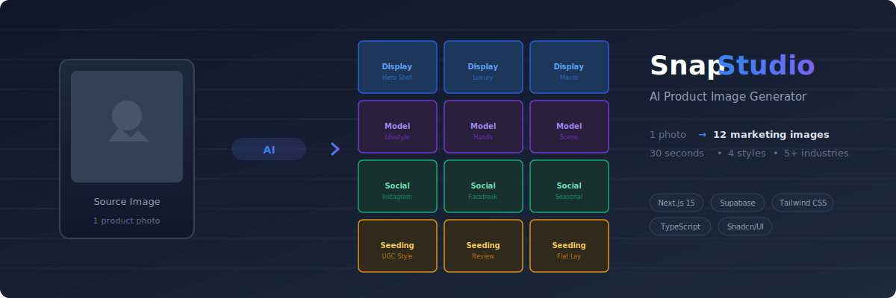
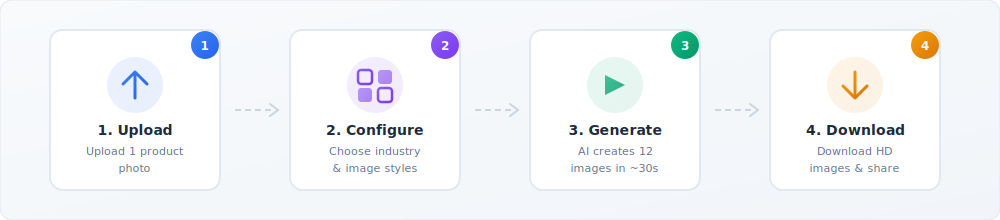
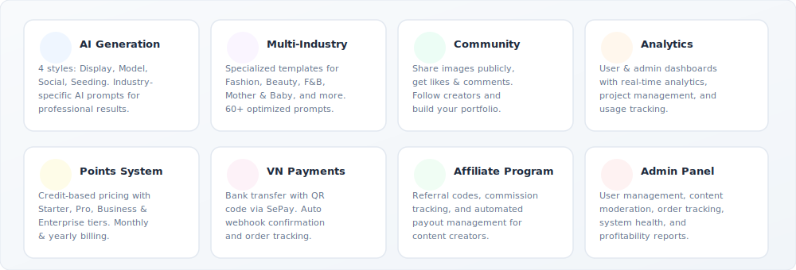
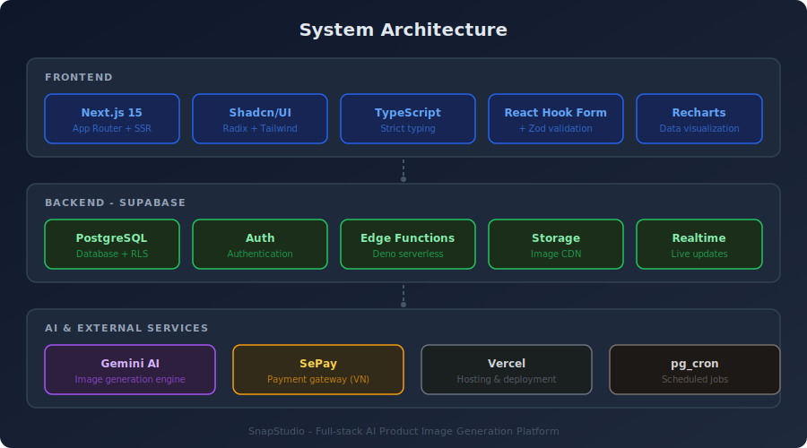

<p align="center">
  
</p>

<p align="center">
  <strong>Transform 1 product photo into 12 professional marketing images in 30 seconds.</strong><br/>
  Save up to 99% compared to traditional studio photography.
</p>

<p align="center">
  
  
  
  
  
</p>

---

## How It Works

<p align="center">
  
</p>

Upload a product photo, choose your industry and styles, and SnapStudio's AI generates 12 professional marketing images across 4 categories - all in about 30 seconds.

## Features

<p align="center">
  
</p>

### Image Generation Styles

| Style | Description | Use Case |
|-------|------------|----------|
| **Display** | Studio-quality product photos | Hero shots, luxury displays, macro details |
| **Model** | Lifestyle images with models | Hands-on demos, scene compositions |
| **Social** | Media-optimized images | Instagram, Facebook, seasonal campaigns |
| **Seeding** | UGC-style authentic photos | Reviews, flat lays, organic marketing |

### Supported Industries

- Fashion & Accessories
- Beauty & Personal Care
- Food & Beverage
- Mother & Baby
- And more...

Each industry has **specialized AI prompts** optimized for that category's visual style.

## Architecture

<p align="center">
  
</p>

### Tech Stack

| Layer | Technology |
|-------|-----------|
| Framework | [Next.js 15](https://nextjs.org/) (App Router) |
| Language | TypeScript |
| UI Components | [Shadcn/UI](https://ui.shadcn.com/) (Radix UI + Tailwind CSS) |
| Styling | [Tailwind CSS](https://tailwindcss.com/) |
| Database | PostgreSQL via [Supabase](https://supabase.com/) |
| Auth | Supabase Auth |
| Serverless | Supabase Edge Functions (Deno) |
| Storage | Supabase Storage |
| AI Engine | Google Gemini |
| Payments | SePay (Vietnam bank transfer + QR) |
| Hosting | Vercel |

## Project Structure

```
src/
├── app/
│   ├── (site)/          # Marketing website (homepage, features, FAQ, blog, contact)
│   ├── dashboard/       # User dashboard (projects, analytics, billing, settings)
│   ├── admin/           # Admin panel (users, orders, analytics, moderation)
│   ├── community/       # Community features (shared images, profiles)
│   └── auth/            # Authentication routes
├── components/
│   ├── ui/              # Shadcn/UI base components
│   ├── admin/           # Admin-specific components
│   ├── dashboard/       # Dashboard components
│   └── layout/          # Layout components (header, footer, sidebar)
├── hooks/               # Custom React hooks
├── lib/                 # Utilities (image generator, payment client, metadata)
└── integrations/
    └── supabase/        # Supabase client configuration

supabase/
├── functions/           # 14 Edge Functions (image gen, payments, analytics)
└── migrations/          # 142 database migrations
```

## Getting Started

### Prerequisites

- [Node.js](https://nodejs.org/) 18+
- [pnpm](https://pnpm.io/) package manager
- A [Supabase](https://supabase.com/) project
- [Gemini API key](https://ai.google.dev/)

### 1. Clone the repository

```bash
git clone https://github.com/ungden/snapstudio.git
cd snapstudio
```

### 2. Install dependencies

```bash
pnpm install
```

### 3. Set up environment variables

Copy the example file and fill in your values:

```bash
cp .env.example .env.local
```

```env
NEXT_PUBLIC_SUPABASE_URL=https://your-project-ref.supabase.co
NEXT_PUBLIC_SUPABASE_ANON_KEY=your-anon-key
SUPABASE_SERVICE_ROLE_KEY=your-service-role-key
GEMINI_API_KEY=your-gemini-api-key
SEPAY_WEBHOOK_API_KEY=your-sepay-webhook-key
```

### 4. Set up Supabase

Apply the database migrations:

```bash
npx supabase db push
```

> **Note**: Migration files contain placeholder emails (`your-admin@example.com`). Update these with your actual admin email before running.

### 5. Run the development server

```bash
pnpm dev
```

Open [http://localhost:3000](http://localhost:3000) in your browser.

## Scripts

| Command | Description |
|---------|------------|
| `pnpm dev` | Start development server |
| `pnpm build` | Build for production |
| `pnpm start` | Start production server |
| `pnpm lint` | Run ESLint |

## Database Schema

Key tables with Row-Level Security (RLS):

| Table | Purpose |
|-------|---------|
| `profiles` | User accounts, subscription plans, points balance |
| `projects` | AI generation projects per user |
| `generated_images` | Output images with styles, prompts, watermarks |
| `prompt_templates` | 60+ AI prompts by category and industry |
| `points_ledger` | Credit transaction history |
| `orders` | Purchase orders and payment tracking |
| `community_likes` / `community_comments` | Social engagement |
| `user_follows` | Creator following system |
| `affiliates` / `affiliate_commissions` | Referral program |

## Edge Functions

| Function | Purpose |
|----------|---------|
| `generate-images` | Batch AI image generation (12 images) |
| `generate-solo-image` | Single image generation |
| `process-batch-generation` | Batch processing orchestrator |
| `create-thumbnail` | Thumbnail generation |
| `add-watermark` | Image watermarking |
| `create-order` | Order creation |
| `confirm-payment` | Payment confirmation |
| `get-order-payment-info` | Payment QR code & info |
| `sepay-webhook` | Payment webhook handler |
| `monthly-points-allocation` | Monthly credits for subscribers |
| `admin-analytics` | Admin dashboard data |
| `admin-profitability` | Revenue & cost reports |
| `custom-claims` | JWT custom claims for roles |
| `create-affiliate-account` | Affiliate account setup |

## Deployment

Optimized for [Vercel](https://vercel.com/):

```bash
pnpm build
```

Configure all environment variables in your Vercel project settings.

## License

This project is licensed under the [Apache License 2.0](LICENSE).

---

<p align="center">
  Built with Next.js, Supabase, and AI.
</p>
